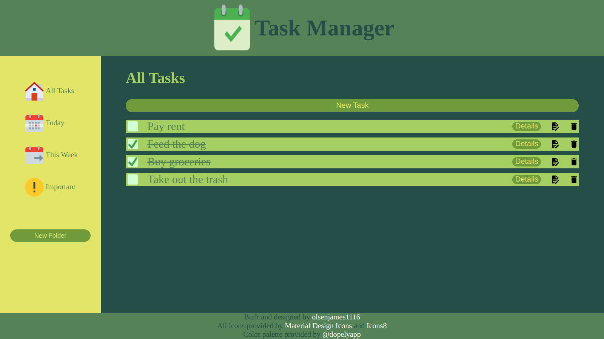
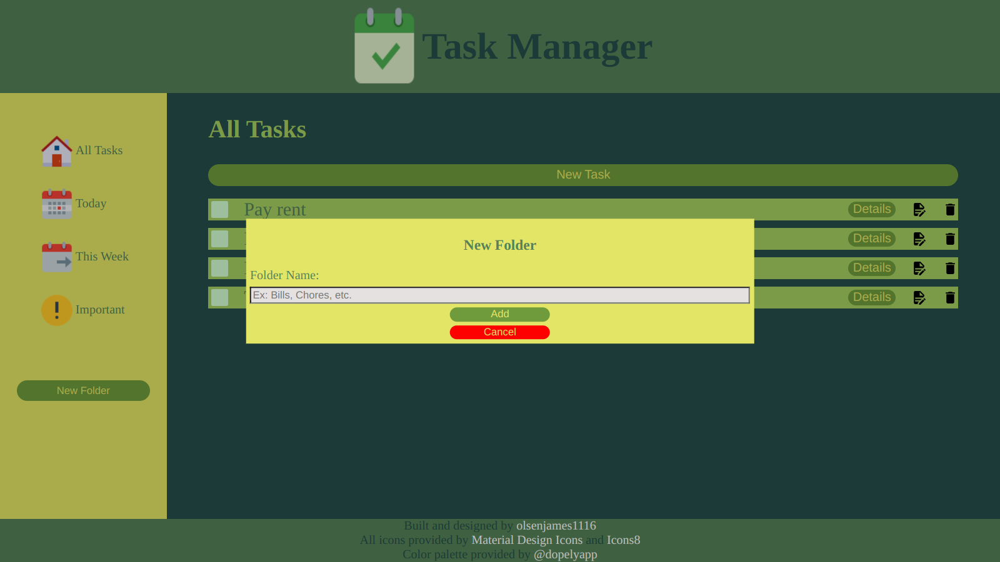
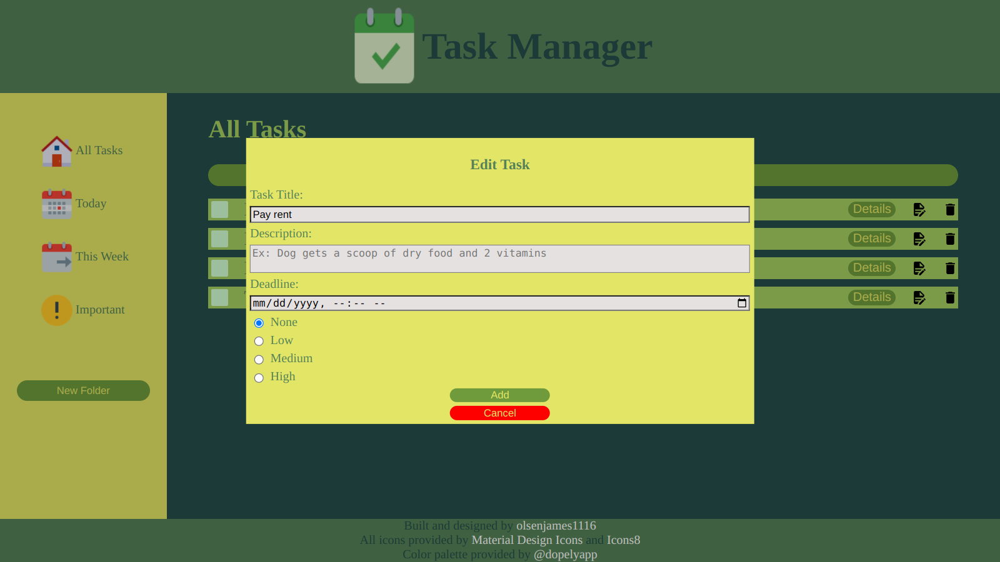
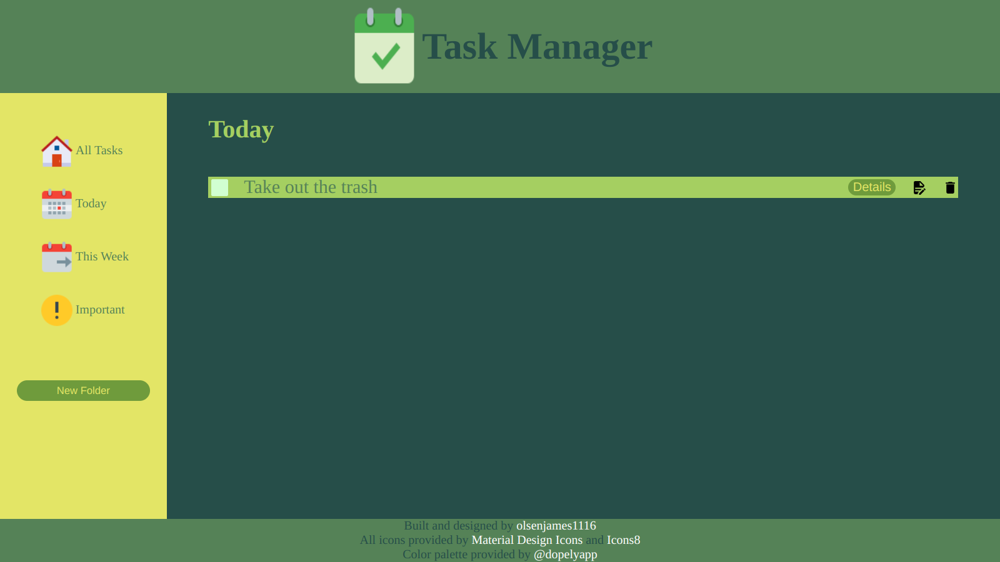
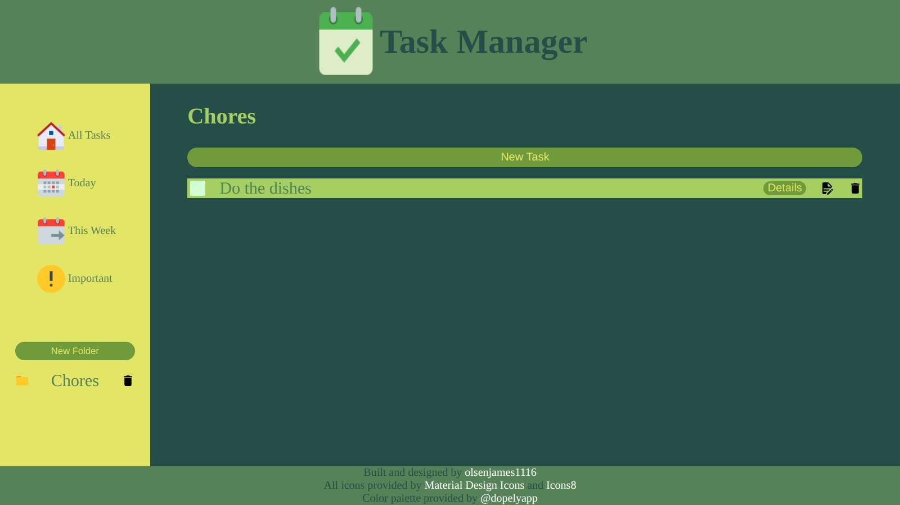

# todoList

## Preview

All Tasks:

New Task:

Edit Task:

Today:

New Folder:

Folder:

## Description

Ever have that feeling that you're forgetting something? You're not alone! Meet the Task Manager app. Add tasks with a title, description, due date and priority. Edit existing tasks as their priority or due dates change. Create folders to organize tasks. Finally, use the sidebar to navigate to pre-existing folders that organize tasks by due dates and importance. All of this is stored on your local machine so you can keep track of your responsibilities. You'll never forget the kid at school again!

This project was built with a focus on OOP, the local storage Web API and ES6 Modules.
